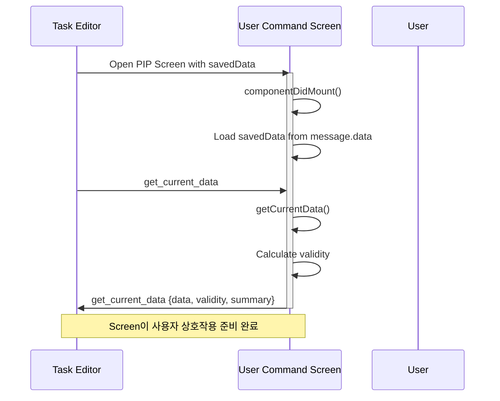
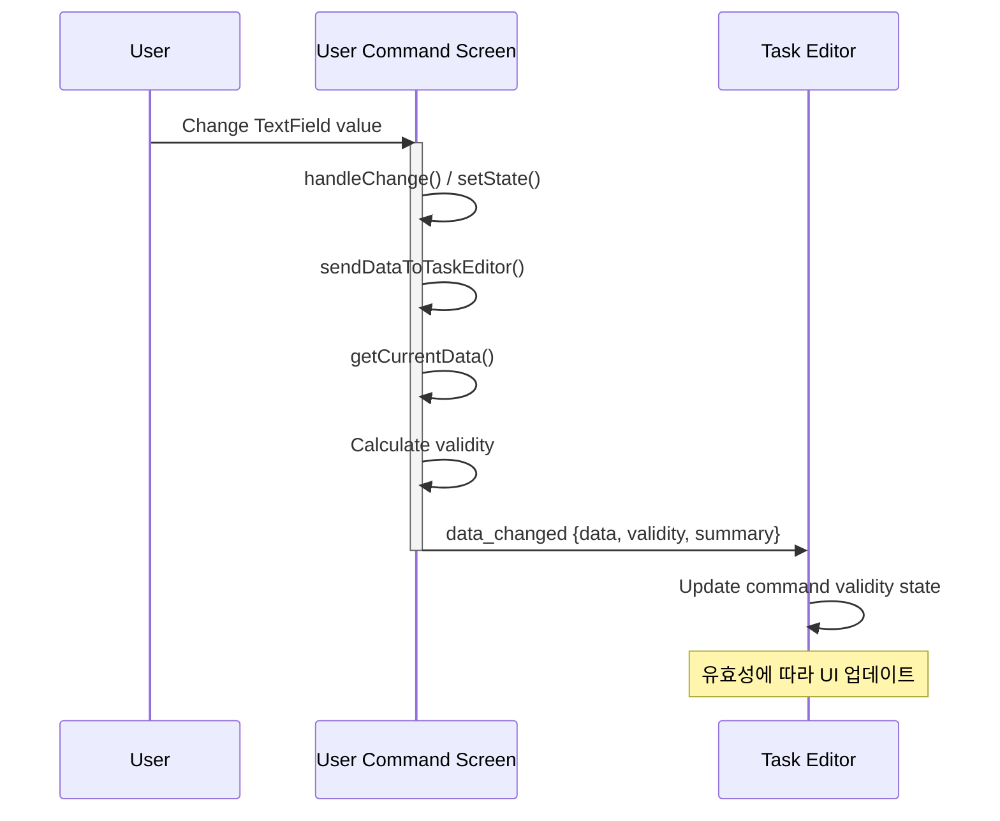
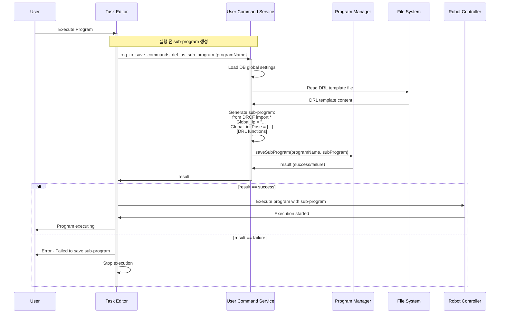
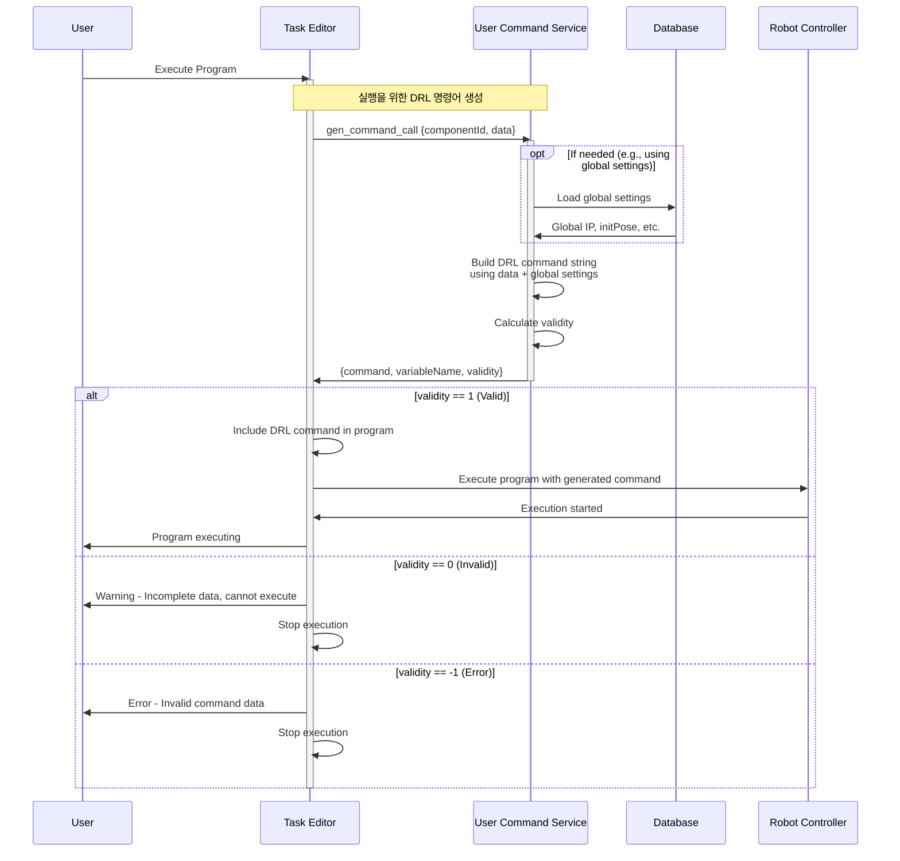
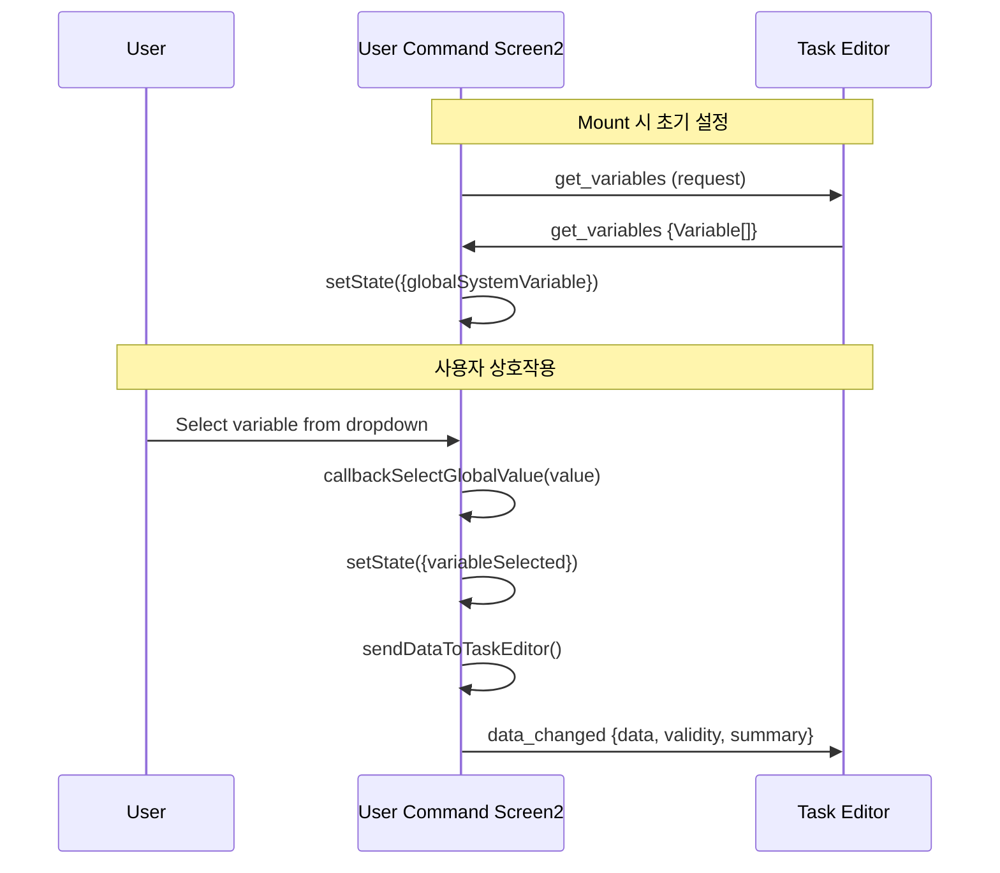
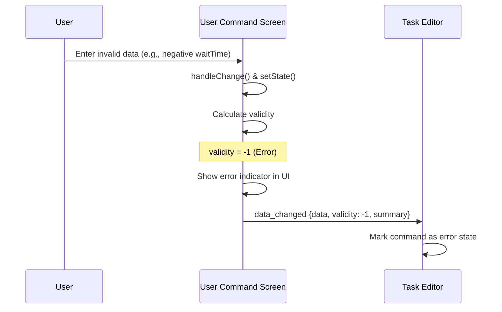

# User Command Module V2 샘플

DART 플랫폼용 User Command Module V2 샘플 구현입니다.

## 목차
- [개요](#개요)
- [Task Editor ↔ Module 인터페이스](#task-editor--module-인터페이스)
  - [인터페이스 개요](#인터페이스-개요)
  - [시퀀스 다이어그램](#시퀀스-다이어그램)
- [V1에서 V2로 마이그레이션 가이드](#v1에서-v2로-마이그레이션-가이드)
- [프로젝트 구조](#프로젝트-구조)
- [주요 기능](#주요-기능)
- [마이그레이션 체크리스트](#마이그레이션-체크리스트)

## 개요

이 샘플은 User Command Module의 V2 인터페이스 구현을 다음과 같이 보여줍니다:
- 두 개의 샘플 사용자 명령어 (연결 및 이동, 포즈 변환)
- 유효성 검사를 포함한 V2 메시지 인터페이스
- 전역 설정을 위한 데이터베이스 통합

### V2 설계 목표

V2 메시지 인터페이스는 다음과 같은 목표로 설계되었습니다:

1. **User Command의 유효성 검사 개선**
   - 세 가지 레벨의 구조화된 유효성 시스템 도입: Error (-1), Invalid (0), Valid (1)
   - Task 편집 중 실시간 유효성 피드백 제공
   - Task Editor가 명령어 상태를 표시하고 유효하지 않은 명령어의 실행을 방지
   - 치명적인 오류와 불완전한 데이터를 명확히 구분

2. **Start/End 폴더 구조 지원**
   - Start/End 폴더 계층 구조 내에서 User Command 구성 지원
   - 더 나은 Task 구성 및 프로그램 흐름 제어 가능
   - User Command를 다른 Task와 논리적으로 그룹화

## Task Editor ↔ Module 인터페이스

### 인터페이스 개요

Task Editor와 User Command Module은 다음 인터페이스를 통해 통신합니다:

#### Screen-Side 인터페이스 (ModuleScreen)

| 인터페이스 | 방향 | 목적 | 응답 형식 |
|-----------|------|------|----------|
| `get_current_data` | TaskEditor ↔ Screen | Request/Response: 현재 명령어 데이터 가져오기 | `{data, validity, summary}` |
| `data_changed` | Screen → TaskEditor | Notify: Screen에서 데이터 변경 알림 | `{data, validity, summary}` |
| `get_variables` | TaskEditor ↔ Screen | Request/Response: 전역/시스템 변수 가져오기 | `Variable[]` |

#### Service-Side 인터페이스 (ModuleService)

| 인터페이스 | 방향 | 목적 | 응답 형식 |
|-----------|------|------|----------|
| `gen_command_call` | TaskEditor ↔ Service | Request/Response: DRL 명령어 생성 **(프로그램 실행 시 호출)** | `{data, validity, summary, command}` |
| `req_to_save_commands_def_as_sub_program` | TaskEditor ↔ Service | Request/Response: Sub-program 저장 **(프로그램 실행 시 호출)** | `boolean` |
| `start_command_data_monitor` | TaskEditor ↔ Service | Request/Response: 모니터링 시작 | `string \| null` |
| `stop_command_data_monitor` | TaskEditor ↔ Service | Request/Response: 모니터링 중지 | `boolean` |
| `update_task_data_to_monitor` | Service → TaskEditor | Request/Response: 모니터링 데이터 업데이트 | `n/a` |
| `command_data_validity_changed` | Service → TaskEditor | Notify: 명령어 유효성 변경 알림 | `{validity, ...}` |

**방향 범례:**
- `↔` (양방향): Request/Response 패턴 - TaskEditor가 요청을 보내고, Module이 응답
- `→` (단방향): Notification 패턴 - 한쪽에서 다른 쪽으로 알림 전송

#### 응답 형식 필드

**validity (V2)**
```typescript
validity: number  // -1: Error, 0: Invalid, 1: Valid
```

**summary**
- **목적**: Task Tree에서 명령어 옆에 표시되는 텍스트
- **예시**:
  - `"Wait 3s, Custom pose [0.0,0.0,500.0,0.0,0.0,0.0]"`
  - `"Convert [100.0,200.0,300.0,45.0,0.0,90.0] → myVariable"`
- **사용법**: 사용자가 명령어가 무엇을 할지 볼 수 있도록 실제 데이터 값을 포함해야 함
- **권장사항**: 변경되는 주요 매개변수(waitTime, pose 값, 변수 이름 등)를 표시
```typescript
summary: string  // Task Tree에 표시되는 데이터 값이 포함된 간단한 설명
```

### 시퀀스 다이어그램

#### 1. Task Editor에서 User Command 열기



#### 2. Screen에서 사용자가 데이터 수정



#### 3. 프로그램 실행 (Sub-Program 정의 저장)

**참고:** V2에서는 `req_to_save_commands_def_as_sub_program`이 프로젝트 저장 시가 아닌 **프로그램 실행 시**에 호출됩니다.



#### 4. 프로그램 실행 (DRL 명령어 생성)

**참고:** V2에서는 `gen_command_call`이 Task 저장 시가 아닌 **프로그램 실행 시**에 호출됩니다.



#### 5. 변수 선택 흐름 (Screen2 예시)



#### 6. 오류 처리 흐름



## V1에서 V2로 마이그레이션 가이드

### 1. manifest.json의 Message Filters 업데이트

**V1:**
```json
{
  "action": "com.dart.module.taskeditor.action.USER_COMMAND",
  "category": "dart.message.category.PIP_SCREEN"
}
```

**V2:**
```json
{
  "action": "com.dart.module.taskeditor.action.USER_COMMAND_V2",
  "category": "dart.message.category.PIP_SCREEN"
}
```

### 2. Screen 통신 인터페이스 업데이트

**참고:** 인터페이스 이름(`get_current_data`, `data_changed`)은 동일하게 유지됩니다. 주요 변경사항은 **응답 형식**, 특히 `validity` 필드입니다.

#### 2.1. `get_current_data` 응답 형식 업데이트

**V1:**
```typescript
channel.receive('get_current_data', () => {
  const currentData = this.getCurrentData();
  const validity = this.getValidity(currentData);

  const response = {
    data: currentData,
    validity: validity // true, false
  } as Record<string, any>;

  channel.send('get_current_data', response);
});
```

**V2:**
```typescript
channel.receive('get_current_data', () => {
  const currentData = this.getCurrentData();
  const validity = this.getValidity(currentData);

  const response = {
    data: currentData,
    validity: validity, // -1: Error, 0: Invalid, 1: Valid
    summary: `Wait ${currentData.waitTime}s, Custom pose [${currentData.pose.join(',')}]` // Task Tree에 실제 데이터 표시
  };

  channel.send('get_current_data', response);
});
```

#### 2.2. `data_changed` 응답 형식 업데이트

**V1:**
```typescript
sendDataToTaskEditor = () => {
  const currentData = this.getCurrentData();
  const validity = this.getValidity(currentData);

  const response = {
    data: currentData,
    validity: validity // true, false
  } as Record<string, any>;

  this.channel.send('data_changed', response);
};
```

**V2:**
```typescript
sendDataToTaskEditor = () => {
  const currentData = this.getCurrentData();
  const validity = this.getValidity(currentData);

  const response = {
    data: currentData,
    validity: validity, // -1: Error, 0: Invalid, 1: Valid
    summary: `Wait ${currentData.waitTime}s, Custom pose [${currentData.pose.join(',')}]` // Task Tree에 실제 데이터 표시
  };

  this.channel.send('data_changed', response);
};
```

### 3. 유효성 검사 메서드 구현

Screen 클래스에 `getValidity()` 메서드를 추가하세요:

```typescript
// 유효성 검사: -1 (Error), 0 (Invalid), 1 (Valid)
getValidity = (data: any): number => {
  // 오류 검사 (치명적인 문제)
  if (data.someValue < 0) {
    return -1; // Error: 음수 값
  }

  if (!data.requiredArray || !Array.isArray(data.requiredArray)) {
    return -1; // Error: 필수 데이터 미정의
  }

  // 유효하지 않은 상태 검사 (불완전한 데이터)
  if (data.optionalField === '') {
    return 0; // Invalid: 불완전한 데이터
  }

  // 모든 검사 통과
  return 1; // Valid
};
```

**유효성 레벨:**
- **-1 (Error)**: 치명적인 오류 - 데이터 타입 불일치, null/undefined 필수 필드, 범위 초과 값
- **0 (Invalid)**: 불완전하지만 치명적이지 않음 - 선택적 필드 누락, 빈 선택
- **1 (Valid)**: 모든 데이터가 유효하고 완전함

### 4. Service 통신 인터페이스 업데이트

**참고:** 인터페이스 이름(`gen_command_call`)은 동일하게 유지됩니다. 주요 변경사항은:
1. **응답 형식**: `validity` 필드 형식이 변경됨
2. **타이밍**: 이러한 인터페이스가 호출되는 시점이 변경됨 (섹션 4.2 참조)

#### 4.1. `gen_command_call` 응답 형식 업데이트

**V1:**
```typescript
channel.receive('gen_command_call', ({ componentId, data }) => {
  let command = 'function_name(';
  command += `${data.param1}, `;
  command += `${data.param2})`;

  const response = {
    command: command
    variableName : data.variableName,
    validity : data.validity, // true, false
  };

  channel.send('gen_command_call', response);
});
```

**V2:**
```typescript
channel.receive('gen_command_call', ({ componentId, data }) => {
  let command = 'function_name(';
  command += `${data.param1}, `;
  command += `${data.param2})`;

  const validity = this.getValidityForComponent(data);

  const response = {
    command: command
    variableName : data.variableName,
    validity : validity, // -1: Error, 0: Invalid, 1: Valid
  };

  channel.send('gen_command_call', response);
});
```

Service 클래스에 유효성 검사 메서드를 추가하세요:

```typescript
private getValidityForComponent(data: any): number {
  // 여기에 유효성 검사 로직 추가
  if (data.param1 < 0) {
    return -1; // Error
  }

  if (data.param2 === '') {
    return 0; // Invalid
  }

  return 1; // Valid
}
```

#### 4.2. 인터페이스 타이밍 변경 (V1 → V2)

**중요:** Service 인터페이스가 호출되는 타이밍이 V1과 V2 사이에 변경되었습니다:

| 인터페이스 | V1 타이밍 | V2 타이밍 |
|-----------|-----------|-----------|
| `gen_command_call` | **data_changed** 이벤트 발생 시마다 호출 | **프로그램 실행 시** 호출 |

**의미:**
- **V1**: `data_changed` 이벤트가 발생할 때마다 DRL 명령어를 생성하기 위해 `gen_command_call`이 호출됨
- **V2**: `gen_command_call`은 로봇 프로그램이 실행되려고 할 때만 호출되며, 명령어를 편집할 때는 호출되지 않음
- 이를 통해 Task 편집 중 불필요한 오버헤드를 줄이고 실행 시점에 가장 최신 데이터로 명령어가 생성됨

**마이그레이션 영향:**
- 코드 변경은 필요하지 않음 - 인터페이스 서명은 동일하게 유지됨
- Service는 이러한 메서드가 편집 시점이 아닌 실행 시점에 호출된다는 것을 인지해야 함
- `gen_command_call` 구현이 효율적인지 확인하세요. 이제 중요한 실행 경로에 있습니다

## 프로젝트 구조

```
com.sample.usercommand/
├── src/
│   ├── assets/
│   │   ├── images/           # 이미지 리소스
│   │   ├── raws/             # Raw 데이터 파일
│   │   └── styles/
│   │       └── _theme.scss   # 전역 테마 변수
│   ├── uc/
│   │   └── task.pose.control/  # 재사용 가능한 포즈 제어 컴포넌트
│   ├── UserCommand/
│   │   ├── UserCommandScreen1.tsx    # 샘플 명령어 1 (대기 & 포즈)
│   │   ├── UserCommandScreen2.tsx    # 샘플 명령어 2 (포즈 변환)
│   │   ├── UserCommandScreen3.tsx    # 커스텀 폴더 명령어
│   │   ├── UserCommandService.ts     # DRL 실행을 위한 Service 레이어
│   │   ├── UserCommandDRL.drl        # 로봇 제어용 DRL 스크립트
│   │   ├── ChannelConstants.ts       # V2 채널 이벤트 상수
│   │   ├── SetGlobalValue.tsx        # 전역 변수 선택 컴포넌트
│   │   └── UserCommandScreen.scss    # PIP 화면용 공유 스타일
│   ├── DatabaseManager.ts     # 영구 저장을 위한 IndexedDB 래퍼
│   ├── DrlUtils.ts           # DRL 유틸리티 함수
│   ├── ErrorFallback.tsx     # Error Boundary 폴백 컴포넌트
│   ├── MainPage1.tsx         # 메인 화면 - 장치 IP 설정
│   ├── MainPage2.tsx         # 메인 화면 - 초기 포즈 설정
│   ├── index.tsx             # 진입점 및 모듈 등록
│   ├── index.scss            # 메인 화면 스타일
│   ├── MainPage1.scss        # 장치 IP 페이지 스타일
│   ├── MainPage2.scss        # 초기 포즈 페이지 스타일
│   └── manifest.json         # 모듈 설정
├── build/                    # 빌드 출력 디렉토리
├── output/                   # 최종 패키징된 모듈 (.dm 파일)
├── libs/                     # DART API 라이브러리
├── manifest.json            # 루트 매니페스트 파일
├── package.json             # NPM 의존성
├── webpack.config.js        # Webpack 빌드 설정
└── README.md
```

## 주요 기능

### UserCommandScreen1 (연결 및 이동)
기본 명령어 데모:
- 데이터베이스 통합을 통한 전역 설정
- 대기 시간 설정
- 로봇 포즈 오버라이드 기능
- 실시간 데이터 유효성 검사

**유효성 검사:**
- 대기 시간은 음수가 아니어야 함
- 초기 포즈는 유효한 6개 요소 배열이어야 함
- useOverridePose는 boolean이어야 함

### UserCommandScreen2 (포즈 변환)
고급 명령어 데모:
- 포즈 좌표 변환 (ZYX에서 ZYZ로)
- 전역/시스템 변수 통합
- Task 포즈 제어 컴포넌트 사용
- 변수 선택 및 유효성 검사

**유효성 검사:**
- ZYX 포즈는 유효한 6개 요소 배열이어야 함
- 변수가 선택되어야 함 (선택되지 않으면 0 반환)

### UserCommandScreen3 (커스텀 폴더)
Task Tree에서 **폴더 구조**를 생성하는 특별한 명령어:
- 자동으로 "Start Custom Folder"와 "End Custom Folder" 명령어 생성
- Start와 End 사이의 모든 작업이 이 폴더 아래로 그룹화됨
- 폴더 이름 및 설명 지원
- 폴더 이름 형식 검증 (영숫자와 언더스코어만 허용)

**응답 형식:**
```typescript
{
  data: {
    folderName: string,
    description: string
  },
  validity: number,
  summary: string,
  command: {
    supportStartEnd: true  // Start-End 구조 활성화
  }
}
```

## 마이그레이션 체크리스트

- [ ] `manifest.json`을 V2 action으로 업데이트 (`USER_COMMAND` → `USER_COMMAND_V2`)
- [ ] `get_current_data` 응답 validity 형식을 `boolean(true, false)` → `number (-1, 0, 1)`로 업데이트
- [ ] `data_changed` 응답 validity 형식을 `boolean(true, false)` → `number (-1, 0, 1)`로 업데이트
- [ ] `gen_command_call` 응답 validity 형식을 `boolean(true, false)` → `number (-1, 0, 1)`로 업데이트
- [ ] Screen 클래스에 `getValidity()` 메서드 구현
- [ ] Service 클래스에 유효성 검사 메서드 구현
- [ ] **(선택사항)** Service에 V2 이벤트 핸들러 추가 (`start_command_data_monitor`, `stop_command_data_monitor`, `update_task_data_to_monitor`, `get_command_defined_data`)
- [ ] **타이밍 변경 이해**: `gen_command_call`과 `req_to_save_commands_def_as_sub_program`은 이제 **프로그램 실행 시** 호출됨 (PIP 화면 열 때가 아님)
- [ ] 모든 유효성 시나리오 테스트 (-1: Error, 0: Invalid, 1: Valid)

## 문서

상세한 구현 가이드는 다음 문서를 참조하세요:
https://developers.drdart.io/guide/ver/pub/implement-the-user-command-interface

## 라이선스

BSD 3-Clause License
Copyright (c) 2025, Doosan Robotics Inc.
