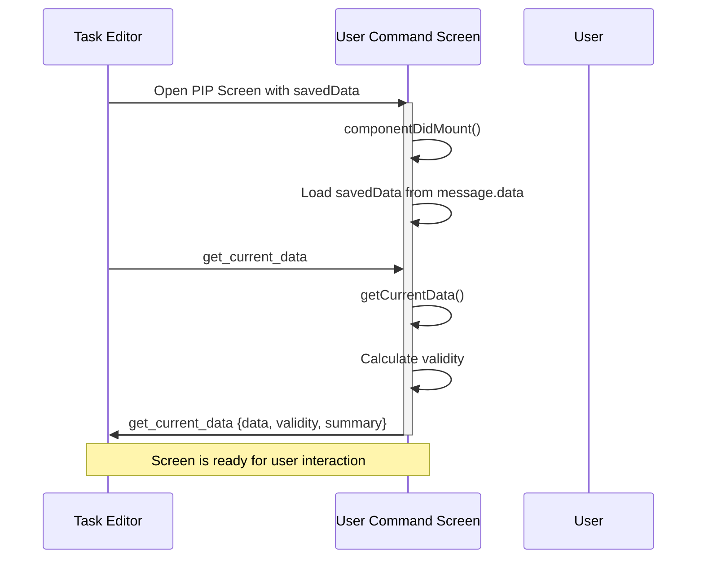
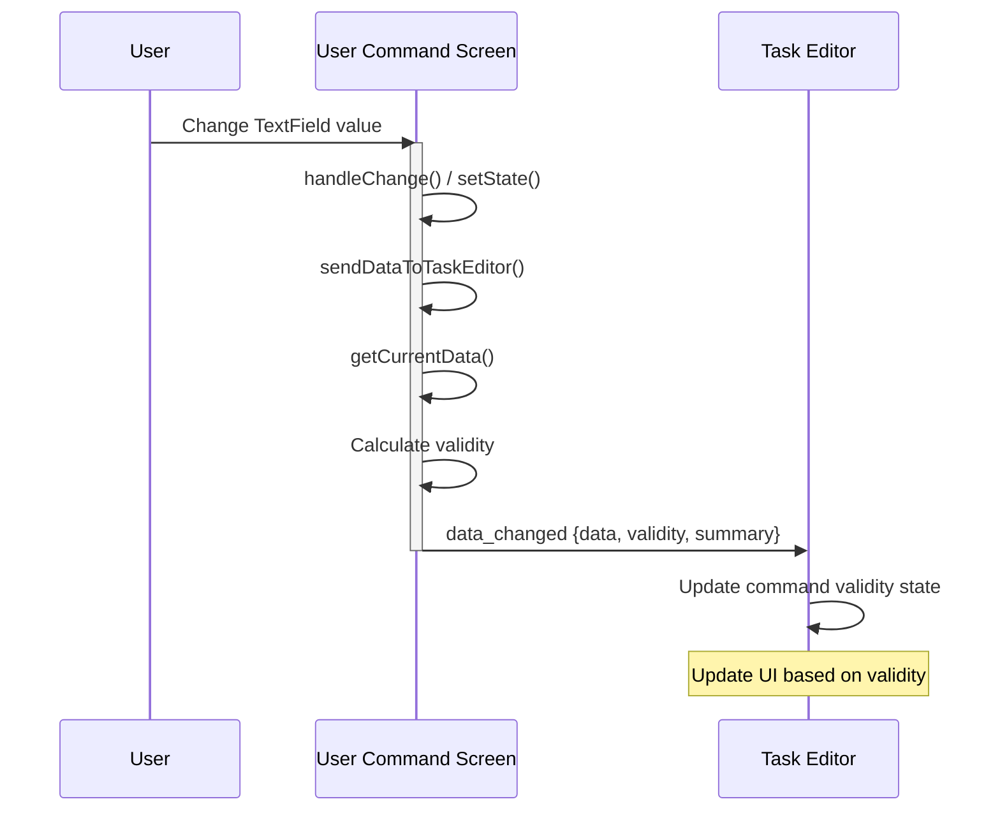
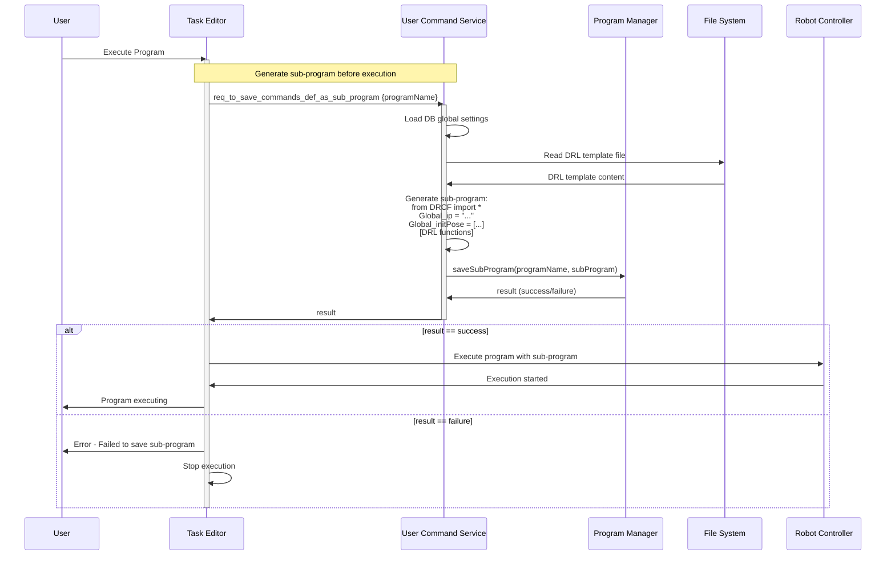
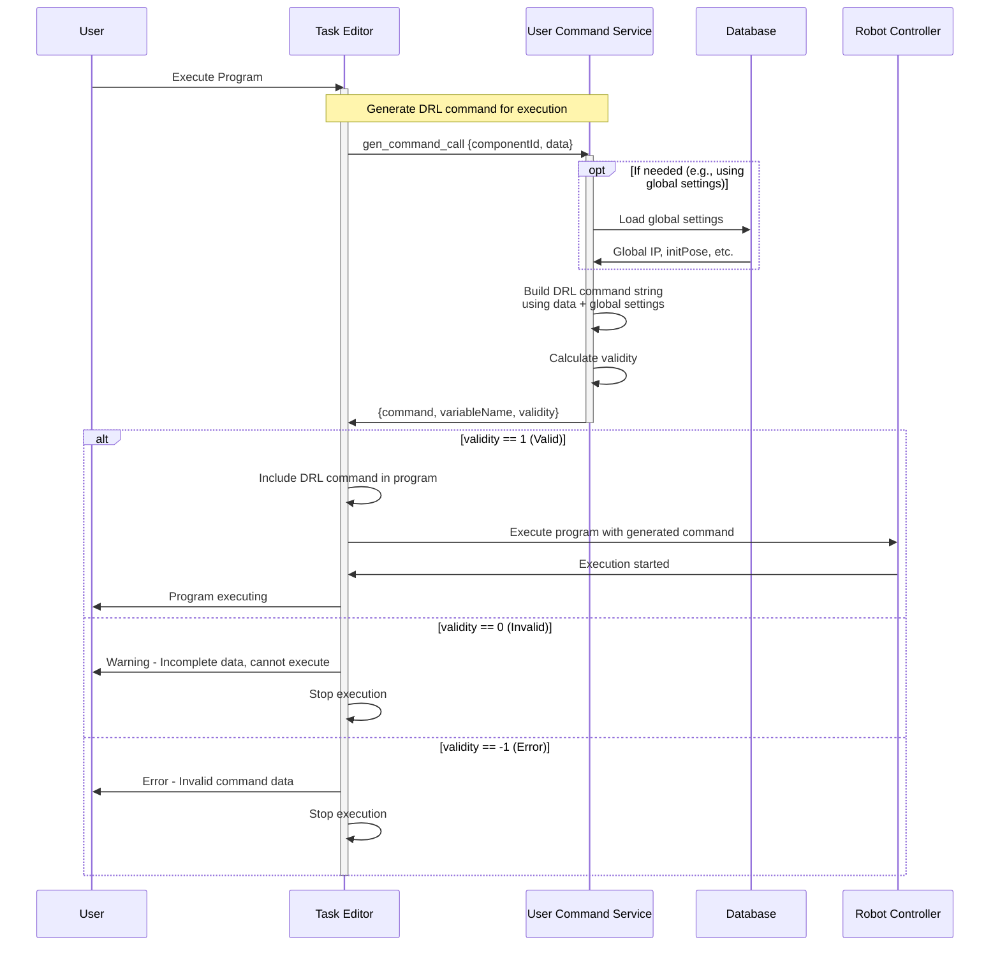
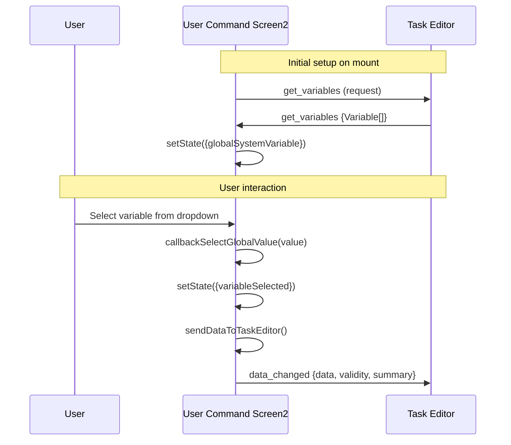
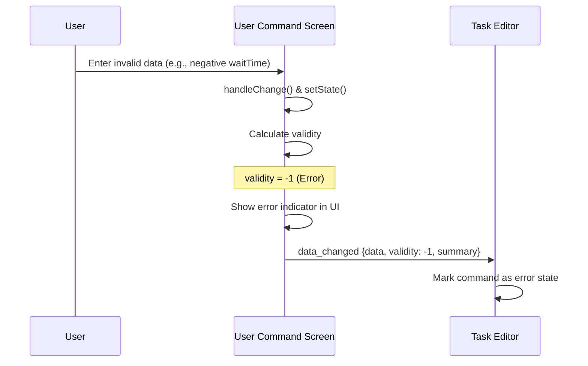

# User Command Module V2 Sample

This is a sample implementation of User Command Module V2 for DART Platform.

## Table of Contents
- [Overview](#overview)
- [Task Editor ↔ Module Interface](#task-editor--module-interface)
  - [Interface Overview](#interface-overview)
  - [Sequence Diagrams](#sequence-diagrams)
- [V1 to V2 Migration Guide](#v1-to-v2-migration-guide)
- [Project Structure](#project-structure)
- [Key Features](#key-features)
- [Migration Checklist](#migration-checklist)

## Overview

This sample demonstrates the V2 interface implementation for User Command modules with:
- Two sample user commands (Connect & Move, Convert Pose)
- V2 message interface with validity checking
- Database integration for global settings

### V2 Design Goals

The V2 message interface was designed with the following objectives:

1. **Improved Validity Checking for User Commands**
   - Introduced a structured validity system with three levels: Error (-1), Invalid (0), and Valid (1)
   - Enables real-time validation feedback during task editing
   - Allows Task Editor to display command status and prevent execution of invalid commands
   - Provides clear distinction between critical errors and incomplete data

2. **Start/End Folder Structure Support**
   - Supports organizing User Commands within Start/End folder hierarchies
   - Enables better task organization and program flow control
   - Allows User Commands to be grouped logically with other tasks

## Task Editor ↔ Module Interface

### Interface Overview

The Task Editor and User Command Module communicate through the following interfaces:

#### Screen-Side Interfaces (ModuleScreen)

| Interface | Direction | Purpose | Response Format |
|-----------|-----------|---------|-----------------|
| `get_current_data` | TaskEditor ↔ Screen | Request/Response: Get current command data | `{data, validity, summary}` |
| `data_changed` | Screen → TaskEditor | Notify: Data changes from Screen | `{data, validity, summary}` |
| `get_variables` | TaskEditor ↔ Screen | Request/Response: Get global/system variables | `Variable[]` |

#### Service-Side Interfaces (ModuleService)

| Interface | Direction | Purpose | Response Format |
|-----------|-----------|---------|-----------------|
| `gen_command_call` | TaskEditor ↔ Service | Request/Response: Generate DRL command **(Called on program execution)** | `{data, validity, summary, command}` |
| `req_to_save_commands_def_as_sub_program` | TaskEditor ↔ Service | Request/Response: Save sub-program **(Called on program execution)** | `boolean` |
| `start_command_data_monitor` | TaskEditor ↔ Service | Request/Response: Start monitoring | `string \| null` |
| `stop_command_data_monitor` | TaskEditor ↔ Service | Request/Response: Stop monitoring | `boolean` |
| `update_task_data_to_monitor` | TaskEditor → Service | Request/Response: Update monitored data | `n/a` |
| `command_data_validity_changed` | Service → TaskEditor | Notify: Command validity changed | `{validity, ...}` |

**Direction Legend:**
- `↔` (Bidirectional): Request/Response pattern - TaskEditor sends request, Module sends response
- `→` (Unidirectional): Notification pattern - One side sends notification to the other

#### Response Format Fields

**validity (V2)**
```typescript
validity: number  // -1: Error, 0: Invalid, 1: Valid
```

**summary**
- **Purpose**: Text displayed next to the command in Task Tree
- **Example**:
  - `"Wait 3s, Custom pose [0.0,0.0,500.0,0.0,0.0,0.0]"`
  - `"Convert [100.0,200.0,300.0,45.0,0.0,90.0] → myVariable"`
- **Usage**: Should include actual data values so users can see what the command will do
- **Best Practice**: Display key parameters that change (waitTime, pose values, variable names, etc.)
```typescript
summary: string  // Brief description with data values shown in Task Tree
```

### Sequence Diagrams

#### 1. Opening User Command in Task Editor



#### 2. User Modifies Data in Screen



#### 3. Program Execution (Saving Sub-Program Definition)

**Note:** In V2, `req_to_save_commands_def_as_sub_program` is invoked at **program execution time**, not when saving the project.



#### 4. Program Execution (Generating DRL Command)

**Note:** In V2, `gen_command_call` is invoked at **program execution time**, not when saving the task.



#### 5. Variable Selection Flow (Screen2 Example)



#### 6. Error Handling Flow



## V1 to V2 Migration Guide

### 1. Update Message Filters in manifest.json

**V1:**
```json
{
  "action": "com.dart.module.taskeditor.action.USER_COMMAND",
  "category": "dart.message.category.PIP_SCREEN"
}
```

**V2:**
```json
{
  "action": "com.dart.module.taskeditor.action.USER_COMMAND_V2",
  "category": "dart.message.category.PIP_SCREEN"
}
```

### 2. Update Screen Communication Interface

**Note:** The interface names (`get_current_data`, `data_changed`) remain the same. The key change is the **response format**, specifically the `validity` field.

#### 2.1. Update `get_current_data` Response Format

**V1:**
```typescript
channel.receive('get_current_data', () => {
  const currentData = this.getCurrentData();
  const validity = this.getValidity(currentData);

  const response = {
    data: currentData,
    validity: validity // true, false
  } as Record<string, any>;

  channel.send('get_current_data', response);
});
```

**V2:**
```typescript
channel.receive('get_current_data', () => {
  const currentData = this.getCurrentData();
  const validity = this.getValidity(currentData);

  const response = {
    data: currentData,
    validity: validity, // -1: Error, 0: Invalid, 1: Valid
    summary: `Wait ${currentData.waitTime}s, Custom pose [${currentData.pose.join(',')}]` // Show actual data in Task Tree
  };

  channel.send('get_current_data', response);
});
```

#### 2.2. Update `data_changed` Response Format

**V1:**
```typescript
sendDataToTaskEditor = () => {
  const currentData = this.getCurrentData();
  const validity = this.getValidity(currentData);

  const response = {
    data: currentData,
    validity: validity // true, false
  } as Record<string, any>;

  this.channel.send('data_changed', response);
};
```

**V2:**
```typescript
sendDataToTaskEditor = () => {
  const currentData = this.getCurrentData();
  const validity = this.getValidity(currentData);

  const response = {
    data: currentData,
    validity: validity, // -1: Error, 0: Invalid, 1: Valid
    summary: `Wait ${currentData.waitTime}s, Custom pose [${currentData.pose.join(',')}]` // Show actual data in Task Tree
  };

  this.channel.send('data_changed', response);
};
```

### 3. Implement Validity Check Method

Add a `getValidity()` method to your Screen class:

```typescript
// Check validity: -1 (Error), 0 (Invalid), 1 (Valid)
getValidity = (data: any): number => {
  // Check for errors (critical issues)
  if (data.someValue < 0) {
    return -1; // Error: negative value
  }

  if (!data.requiredArray || !Array.isArray(data.requiredArray)) {
    return -1; // Error: required data not defined
  }

  // Check for invalid state (incomplete data)
  if (data.optionalField === '') {
    return 0; // Invalid: incomplete data
  }

  // All checks passed
  return 1; // Valid
};
```

**Validity Levels:**
- **-1 (Error)**: Critical errors - data type mismatch, null/undefined required fields, out of range values
- **0 (Invalid)**: Incomplete but not critical - missing optional fields, empty selections
- **1 (Valid)**: All data is valid and complete

### 4. Update Service Communication Interface

**Note:** The interface name (`gen_command_call`) remains the same. The key changes are:
1. **Response format**: The `validity` field format has changed
2. **Timing**: When these interfaces are called has changed (see section 4.2)

#### 4.1. Update `gen_command_call` Response Format

**V1:**
```typescript
channel.receive('gen_command_call', ({ componentId, data }) => {
  let command = 'function_name(';
  command += `${data.param1}, `;
  command += `${data.param2})`;

  const response = {
    command: command
    variableName : data.variableName,
    validity : data.validity, // true, false
  };

  channel.send('gen_command_call', response);
});
```

**V2:**
```typescript
channel.receive('gen_command_call', ({ componentId, data }) => {
  let command = 'function_name(';
  command += `${data.param1}, `;
  command += `${data.param2})`;

  const validity = this.getValidityForComponent(data);

  const response = {
    command: command
    variableName : data.variableName,
    validity : validity, // -1: Error, 0: Invalid, 1: Valid
  };

  channel.send('gen_command_call', response);
});
```

Add validity check methods in your Service class:

```typescript
private getValidityForComponent(data: any): number {
  // Add your validation logic here
  if (data.param1 < 0) {
    return -1; // Error
  }

  if (data.param2 === '') {
    return 0; // Invalid
  }

  return 1; // Valid
}
```

#### 4.2. Interface Timing Changes (V1 → V2)

**IMPORTANT:** The timing of when Service interfaces are called has changed between V1 and V2:

| Interface | V1 Timing | V2 Timing |
|-----------|-----------|-----------|
| `gen_command_call` | Called on **data_changed** event | Called on **program execution** |

**What this means:**
- **V1**: Whenever `data_changed` event occurs, `gen_command_call` was invoked to generate the DRL command
- **V2**: `gen_command_call` is only invoked when the robot program is about to execute, not when editing the command
- This reduces unnecessary overhead during task editing and ensures commands are generated with the most current data at execution time

**Migration Impact:**
- No code changes are required - the interface signatures remain the same
- Your Service should be aware that these methods are now called at execution time, not edit time
- Ensure your `gen_command_call` implementation is efficient, as it's now on the critical execution path

## Project Structure

```
com.sample.usercommand/
├── src/
│   ├── assets/
│   │   ├── images/           # Image assets
│   │   ├── raws/             # Raw data files
│   │   └── styles/
│   │       └── _theme.scss   # Global theme variables
│   ├── uc/
│   │   └── task.pose.control/  # Reusable pose control component
│   ├── UserCommand/
│   │   ├── UserCommandScreen1.tsx    # Sample command 1 (Wait & Pose)
│   │   ├── UserCommandScreen2.tsx    # Sample command 2 (Pose Conversion)
│   │   ├── UserCommandScreen3.tsx    # Custom Folder command
│   │   ├── UserCommandService.ts     # Service layer with DRL execution
│   │   ├── UserCommandDRL.drl        # DRL script for robot control
│   │   ├── ChannelConstants.ts       # V2 channel event constants
│   │   ├── SetGlobalValue.tsx        # Global variable selector component
│   │   └── UserCommandScreen.scss    # Shared styles for PIP screens
│   ├── DatabaseManager.ts     # IndexedDB wrapper for persistent storage
│   ├── DrlUtils.ts           # DRL utility functions
│   ├── ErrorFallback.tsx     # Error boundary fallback components
│   ├── MainPage1.tsx         # Main screen - Device IP settings
│   ├── MainPage2.tsx         # Main screen - Initial pose settings
│   ├── index.tsx             # Entry point and module registration
│   ├── index.scss            # Main screen styles
│   ├── MainPage1.scss        # Device IP page styles
│   ├── MainPage2.scss        # Initial pose page styles
│   └── manifest.json         # Module configuration
├── build/                    # Build output directory
├── output/                   # Final packaged module (.dm files)
├── libs/                     # DART API libraries
├── manifest.json            # Root manifest file
├── package.json             # NPM dependencies
├── webpack.config.js        # Webpack build configuration
└── README.md
```

## Key Features

### UserCommandScreen1 (Connect & Move)
Basic command demonstrating:
- Database integration for global settings
- Wait time configuration
- Robot pose override functionality
- Real-time data validation

**Validation:**
- Wait time must not be negative
- Initial pose must be a valid 6-element array
- useOverridePose must be boolean

### UserCommandScreen2 (Pose Conversion)
Advanced command showing:
- Pose coordinate conversion (ZYX to ZYZ)
- Global/System variable integration
- Task pose control component usage
- Variable selection and validation

**Validation:**
- ZYX pose must be a valid 6-element array
- Variable must be selected (returns 0 if not selected)

### UserCommandScreen3 (Custom Folder)
Special command that creates a **folder structure** in the Task Tree:
- Automatically creates "Start Custom Folder" and "End Custom Folder" commands
- All tasks between Start and End are grouped under this folder
- Supports folder naming and descriptions
- Validates folder name format (alphanumeric and underscore only)

**Response Format:**
```typescript
{
  data: {
    folderName: string,
    description: string
  },
  validity: number,
  summary: string,
  command: {
    supportStartEnd: true  // Enables start-end structure
  }
}
```

## Migration Checklist

- [ ] Update `manifest.json` with V2 action (`USER_COMMAND` → `USER_COMMAND_V2`)
- [ ] Update `get_current_data` response validity format from `boolean(true, false)` → `number (-1, 0, 1)`
- [ ] Update `data_changed` response validity format from `boolean(true, false)` → `number (-1, 0, 1)`
- [ ] Update `gen_command_call` response validity format from `boolean(true, false)` → `number (-1, 0, 1)`
- [ ] Implement `getValidity()` method in Screen classes
- [ ] Implement validity check methods in Service class
- [ ] **(Optional)** Add V2 event handlers to Service (`start_command_data_monitor`, `stop_command_data_monitor`, `update_task_data_to_monitor`, `get_command_defined_data`)
- [ ] **Understand timing changes**: `gen_command_call` and `req_to_save_commands_def_as_sub_program` are now called on **program execution** (not when opening PIP screen)
- [ ] Test all validity scenarios (-1: Error, 0: Invalid, 1: Valid)

## Documentation

For detailed implementation guide, see:
https://developers.drdart.io/guide/ver/pub/implement-the-user-command-interface

## License

BSD 3-Clause License
Copyright (c) 2025, Doosan Robotics Inc.
